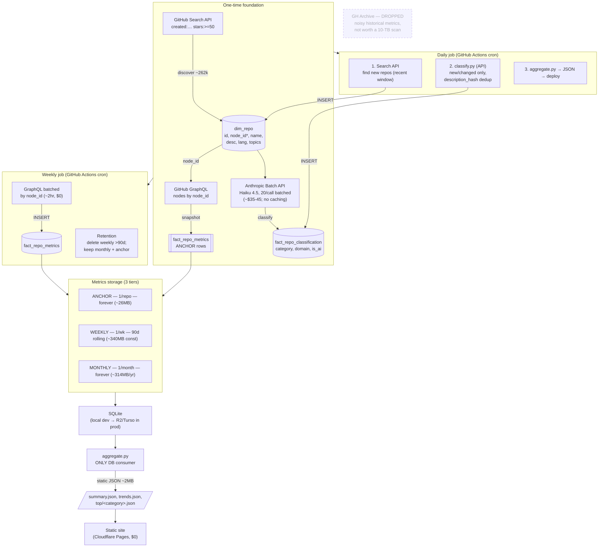

# whats-building

A web page that visualizes what people are building on GitHub — what categories
and domains new repos fall into, and how their stars/watchers evolve over time,
with a lens on the pre- vs post-AI-boom split.

## Architecture

Scope: repos created ≥ 2021-07-19 **and** stars ≥ 50 → ~262k repos.



`*` `node_id` = GraphQL global ID (rename-proof); Search API returns it directly.

## Data model

Full DDL in `schema.sql`. SQLite locally (`whats_building.db`) during development;
migrate to Supabase (Postgres) once the pipeline is proven. Schema is kept
Postgres-compatible.

- `dim_repo` — one row per repo (identity + slow-changing metadata): `node_id`
  (GraphQL global ID, rename-proof), `owner`/`owner_type` (User vs Org), name,
  description, homepage, language, license, `is_fork`, `is_template`,
  `default_branch`, `size_kb`, `created_at`, `pushed_at` + `archived` (refreshed
  daily), `first_seen_at`.
- `fact_repo_metrics` — append-only time-series, keyed `(repo_id, snapshot_date)`,
  with a `tier` column (`anchor`/`daily`/`monthly`) driving retention. Holds
  stars/forks/watchers/open-issues snapshots. See retention design below.
- `fact_repo_classification` — one row per repo (category, domain,
  is_ai_built_or_related, confidence), deduped on `description_hash`.
- `dim_topic` / `bridge_repo_topic` — GitHub topic tags (sparse, ~52% untagged).

## Scope / discovery filter

Repos **created since 2021-07-19** (rolling 5-year window) with **stars ≥ 50**.
Real count via GitHub Search API: **~262k repos**.

- The 5-year window is deliberate: it straddles the AI boom (ChatGPT Nov 2022),
  giving a pre-boom-created cohort to compare against post-boom-created repos.
- stars ≥ 50 is the chosen floor: broad enough to catch a real long tail
  (stars ≥ 100 = 144k drops too much of the emerging/rising tail; stars ≥ 10 =
  1.06M is mostly dead noise and breaks the storage/budget). 50 nearly doubles
  the 100 sample for ~$11–20 more one-time and **zero** extra recurring cost.
- The `created:>{window}` + `stars:>=N` filter structurally overrepresents
  AI-tooling-about-AI-tooling. That bias is accepted scope, not a bug.

## Data sources

**GitHub Search API + GraphQL only. GH Archive is NOT used.**

GH Archive was evaluated and dropped: its only unique value was historical
(pre-today) metric points, and we chose to start the trend from today forward
rather than run a multi-TB BigQuery backfill of noisy, sparse event-time data.
Everything else is cleaner via the live API.

- **Discovery** — GitHub Search API (`/search/repositories`, `created:… stars:>=50`)
  returns the qualifying repo set. Same semantics as the scope filter.
  **Caveat:** Search caps at **1,000 results per query**, so 262k can't be paged
  in one shot — slice by `created` date ranges (or star bands) so each slice is
  <1,000 hits, then paginate each slice.
- **Metrics** — GitHub GraphQL, batched by `node_id`:

  ```graphql
  query($ids: [ID!]!) {
    nodes(ids: $ids) {
      ... on Repository {
        id
        nameWithOwner        # catches renames
        isArchived
        stargazerCount       # real stars
        forkCount
        watchers { totalCount }   # REAL watchers (not the REST duplicate)
      }
    }
  }
  ```

  100 repos/request, ~1 point each; 262k repos ≈ 2,625 requests, well under the
  5,000 points/hr budget → full refresh in ~2 hours, $0.

  **Note:** REST `watchers_count` is a duplicate of `stargazers_count` (GitHub
  quirk). The initial 100-repo pilot has this bug. Going forward, `watchers_count`
  stores the real `watchers.totalCount` from GraphQL.

## Metrics retention (tiered)

Bounds storage to a near-constant size while keeping both recent detail and the
long-run arc:

- **Anchor** — the foundation-day snapshot, 1 row/repo, **never deleted**.
  Guarantees "evolution since day one" regardless of what rolls off.
- **Weekly** — one row/repo/week, kept **90 days rolling** (delete older).
  Constant ~3.4M rows ≈ 340 MB at 262k repos; does not accumulate.
- **Monthly** — one row/repo/month, kept **forever**. Grows ~314 MB/year.

**Weekly, not daily** (decided): daily per-repo granularity is over-collection for
a dashboard of multi-year trends — no chart in scope renders differently — while
costing ~7× the storage (2.4 GB vs 340 MB). That difference is what puts the whole
dataset inside free tiers. It also cuts the expensive ~2 h GraphQL run from 30×
to ~4× per month.

Trajectory: ~340 MB now, +~314 MB/yr → comfortably inside R2's 10 GB free tier for
~20+ years. Downsample monthly → quarterly if ever needed. All append-only; never
overwrite a prior snapshot.

## Classification

- **Bulk (one-time):** Anthropic **Batch API**, Haiku 4.5, **batched**
  (`classify.py --batch`). Two levers keep all 262k repos cheap:
  1. **Request batching** — 20 repos per call (`classify_repos` tool returns an
     array, each row echoing its `repo_id`) so the ~1,500-token system prompt is
     amortized ~20× instead of re-paid per repo. This is the dominant saving.
  2. **Batch API** — 50% off.

  **Prompt caching does NOT apply:** Haiku 4.5's minimum cacheable prefix is 4,096
  tokens; the system prompt is ~1,500, below the floor, so it silently won't cache
  (`cache_creation_input_tokens: 0`). Batching is therefore the only prompt-cost
  lever. Realistic cost **~$35–45 one-time** for the full 262k (vs ~$210 naive
  1-repo/call). Output tokens dominate at this batch size.

  Rejected alternatives: subscription/`claude -p` (weeks of babysitting ~420M
  tokens to save ~$40); local Ollama is the **$0 fallback** but this box has no
  discrete GPU (Iris Xe only), so CPU inference means days–weeks of compute at
  lower quality.
- **Daily (incremental):** `classify.py` (no `--batch`) — synchronous, regular
  API, for newly discovered repos only. Skips unchanged descriptions via
  `description_hash`; re-classifies only on description change. Cents/day.

## Scheduled jobs

**Daily** (cheap, minutes):

1. **Discover** new repos crossing the filter (Search API, recent date window
   only — not a full re-crawl) → insert into `dim_repo`.
2. **Classify** new/changed repos (`classify.py`, regular API). Cents/day.
3. **Aggregate** → `site/data/*.json` → deploy the static site.

**Weekly** (the expensive one, ~2 h):

4. **Refresh metrics** for all tracked repos (batched GraphQL by `node_id`) →
   insert this week's `fact_repo_metrics` rows at `tier=weekly`. Mark deleted
   repos (null node) as gone.
5. **Retention** — delete `weekly` rows older than 90 days; on the 1st of the
   month, write a `monthly` row instead. Never touch `anchor`.

Rate/cost: $0 GitHub (rate-limited), cents Anthropic.

Caveat: `whats_building.db` is currently a tracked binary in git — a scheduled job
rewriting it bloats history. Gitignore it (treat as regenerable state) before
automating; production state lives in R2.

## Website / publishing

The site is **static JSON only — it never queries a database.** `aggregate.py`
(step 5 of the daily job) is the sole DB consumer; it collapses 262k repos and
millions of metric rows into a few thousand numbers:

| File | Contents | Size |
|---|---|---|
| `summary.json` | category/domain/language counts, created-by-month, pre/post-boom split | ~50 KB |
| `trends.json` | star + watcher totals per category per snapshot date | ~200 KB |
| `top/<category>.json` | top 100 repos per category, full detail | ~170 KB each, lazy-loaded |

Written with `ensure_ascii=False` — many descriptions are non-Latin, and ASCII
escaping nearly doubled file size (297 KB → 173 KB per top list).

Consequences worth keeping:

- Hosting is **$0** (Cloudflare Pages / Netlify / GitHub Pages) with no backend
  and no DB in the request path. Visitors download a few hundred KB.
- Swapping the pipeline's store is a **one-file change** (`aggregate.py`), because
  nothing else reads the DB.
- Curated-dashboard + top-100 exploration is fully served by static files.
  Arbitrary free-text search across all 262k repos is **not** — that would need a
  live query backend, and is deliberately out of scope.

## Deployment (production)

Local SQLite + cron is the **development** setup only. Production must run
unattended. Two constraints shaped the choice:

1. **Supabase alone does not solve this.** It is storage, not compute. The
   metrics job is a ~2-hour Python process (262k repos over GraphQL), far beyond
   Edge Function timeouts. Compute is needed regardless of where the DB lives.
2. **Metrics resolution is the entire cost driver** — at daily cadence, 262k ×
   90 days ≈ 23.6M rows ≈ 2.4 GB. Anchor (26 MB) and monthly (314 MB/yr) are
   trivial. Weekly cuts it to ~340 MB.

**Decided: GitHub Actions + Cloudflare R2, at $0.** Weekly resolution keeps the
DB ~340 MB, well inside R2's 10 GB free tier with no egress fees. Rejected:
Hetzner CX22 (~€4/mo), Fly.io (~$5/mo), Turso/Cloudflare D1 (hosted SQLite — the
existing `schema.sql` would port unchanged, but they still need external compute),
Supabase Pro ($25/mo, buying Postgres features this workload never uses).

Shape of it:

- **Workflows** — a daily job (discover → classify → aggregate → deploy) and a
  weekly job (full metrics snapshot + retention). The ~2 h snapshot fits well
  inside Actions' 6 h per-job limit.
- **State** — the SQLite file lives in R2; each run pulls it, mutates it, pushes
  it back. At ~340 MB that transfer is quick and R2 egress is free.
- **Minutes** — Actions is unlimited on public repos; on a private repo the
  weekly 2 h run plus short daily runs lands near ~500 of the 2,000 free min/mo.
- **Secrets** — `GITHUB_TOKEN` (a PAT — the Actions-provided token doesn't carry
  the Search/GraphQL rate limit we need), `ANTHROPIC_API_KEY`, R2 credentials.
- **Concurrency** — daily and weekly jobs both write the DB and must not overlap.
  Put them in a shared Actions `concurrency` group; a mid-run push from an
  overlapping job would silently lose writes.

## Cost summary

- GH Archive / BigQuery: **$0** (not used).
- GitHub API (discovery + daily metrics): **$0** (rate-limited only).
- Bulk classification: **~$35–45 one-time** (batched Batch API; no caching on Haiku).
- Daily classification: **cents/day**.
- Site hosting: **$0** (static JSON, no backend).
- Pipeline hosting: **$0** during dev (local); **$0–5/mo** in production
  (GitHub Actions + R2, or a ~€4 VPS). Supabase Pro's $25 is not required.

## Status / where we left off

- [x] Pilot: 100 repos pulled (GitHub API), classified, one metrics snapshot.
- [x] Architecture designed and locked (this doc).
- [x] Schema finalized (`schema.sql`) and DB recreated with full field set (incl. `node_id`, `tier`).
- [x] Discovery script: Search API → **262,902 repos** in `dim_repo` (created 2021-07-19..2026-07-21, stars ≥50, `fork:false`). Full clean run takes **~4.7 h**. `discover.py` retries 5xx *and* connection-drop exceptions — both killed earlier runs mid-crawl.
- [~] Foundation metrics snapshot: `snapshot.py` built + validated (real watchers ≠ stars confirmed); full anchor run pending.
- [x] Rework `classify.py` to batched Batch API (`--batch`); sync mode for daily. Pending: full bulk run (~$35–45).
- [x] Decided: **weekly** metrics resolution, **GitHub Actions + Cloudflare R2** ($0) for production.
- [ ] Daily job (discover + classify + aggregate) and weekly job (metrics + retention).
- [x] Gitignored `whats_building.db` (+ logs, `__pycache__`, `site/data/`) and untracked it. History was never bloated — the committed blob was the 0.1 MB pilot DB, so no rewrite needed.
- [~] `aggregate.py` stubbed (DB → static JSON). Runs; output is thin until classification lands.
- [ ] Web page (viz) — static site consuming `site/data/*.json`.
- [ ] Actions workflows + R2 state push/pull; secrets (PAT, Anthropic key, R2 creds).
