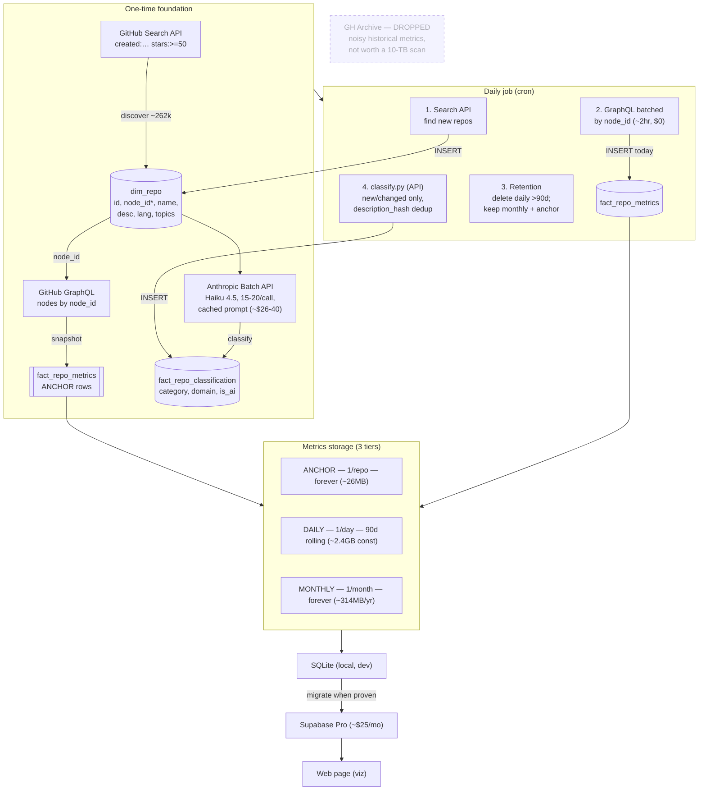

# whats-building

A web page that visualizes what people are building on GitHub — what categories
and domains new repos fall into, and how their stars/watchers evolve over time,
with a lens on the pre- vs post-AI-boom split.

## Architecture

Scope: repos created ≥ 2021-07-19 **and** stars ≥ 50 → ~262k repos.



`*` `node_id` = column to add to `dim_repo` (GraphQL global ID; rename-proof).

## Data model

SQLite locally (`whats_building.db`) during development; migrate to Supabase
(Postgres) once the pipeline is proven. Schema is kept Postgres-compatible.

- `dim_repo` — one row per repo (identity + static-ish metadata). **Needs a
  `node_id` column added** (GitHub GraphQL global ID) for rename/redirect-proof
  metric refreshes.
- `fact_repo_metrics` — append-only time-series, keyed `(repo_id, snapshot_date)`.
  Holds stars/forks/watchers snapshots. See retention design below.
- `fact_repo_classification` — one row per repo (category, domain,
  is_ai_built_or_related, confidence), deduped on `description_hash`.
- `dim_topic` / `bridge_repo_topic` — GitHub topic tags (sparse, ~52% untagged).

## Scope / discovery filter

Repos **created since 2021-07-19** (rolling 5-year window) with **stars ≥ 50**.
Real count via GitHub Search API: **~262k repos**.

- The 5-year window is deliberate: it straddles the AI boom (ChatGPT Nov 2022),
  giving a pre-boom-created cohort to compare against post-boom-created repos.
- stars ≥ 50 is the chosen floor: broad enough to catch a real long tail
  (stars ≥ 100 = 144k drops too much of the emerging/rising tail; stars ≥ 10 =
  1.06M is mostly dead noise and breaks the storage/budget). 50 nearly doubles
  the 100 sample for ~$11–20 more one-time and **zero** extra recurring cost.
- The `created:>{window}` + `stars:>=N` filter structurally overrepresents
  AI-tooling-about-AI-tooling. That bias is accepted scope, not a bug.

## Data sources

**GitHub Search API + GraphQL only. GH Archive is NOT used.**

GH Archive was evaluated and dropped: its only unique value was historical
(pre-today) metric points, and we chose to start the trend from today forward
rather than run a multi-TB BigQuery backfill of noisy, sparse event-time data.
Everything else is cleaner via the live API.

- **Discovery** — GitHub Search API (`/search/repositories`, `created:… stars:>=50`)
  returns the qualifying repo set. Same semantics as the scope filter.
  **Caveat:** Search caps at **1,000 results per query**, so 262k can't be paged
  in one shot — slice by `created` date ranges (or star bands) so each slice is
  <1,000 hits, then paginate each slice.
- **Metrics** — GitHub GraphQL, batched by `node_id`:

  ```graphql
  query($ids: [ID!]!) {
    nodes(ids: $ids) {
      ... on Repository {
        id
        nameWithOwner        # catches renames
        isArchived
        stargazerCount       # real stars
        forkCount
        watchers { totalCount }   # REAL watchers (not the REST duplicate)
      }
    }
  }
  ```

  100 repos/request, ~1 point each; 262k repos ≈ 2,625 requests, well under the
  5,000 points/hr budget → full refresh in ~2 hours, $0.

  **Note:** REST `watchers_count` is a duplicate of `stargazers_count` (GitHub
  quirk). The initial 100-repo pilot has this bug. Going forward, `watchers_count`
  stores the real `watchers.totalCount` from GraphQL.

## Metrics retention (tiered)

Bounds storage to a near-constant size while keeping both recent detail and the
long-run arc:

- **Anchor** — the foundation-day snapshot, 1 row/repo, **never deleted**.
  Guarantees "evolution since day one" regardless of what rolls off.
- **Daily** — one row/repo/day, kept **90 days rolling** (delete older). Constant
  ~24M rows ≈ 2.4 GB at 262k repos; does not accumulate.
- **Monthly** — one row/repo/month, kept **forever**. Grows ~314 MB/year.

Trajectory: ~2.4 GB now, +~314 MB/yr → 8 GB (Supabase Pro cap) in ~10–15 years
accounting for repo-set growth. Downsample monthly → quarterly after ~2 years if
ever needed. All append-only; never overwrite a prior snapshot.

## Classification

- **Bulk (one-time):** Anthropic **Batch API**, Haiku 4.5, **batched** — three
  optimizations stack to keep all 262k repos cheap:
  1. **Request batching** — 15–20 repos per call so the ~1,500-token system
     prompt is amortized instead of re-paid per repo (the dominant cost). Echo
     repo IDs in the output to keep rows aligned.
  2. **Prompt caching** — mark the system prompt cached (0.1× on reads).
  3. **Batch API** — 50% off.

  Result: ~$0.0001–0.00015/repo → **~$26–40 one-time** for the full 262k, at full
  Haiku quality (vs ~$210 for the naive 1-repo-per-call path). Requires reworking
  `classify.py` from its current 1-repo/call form.

  Rejected alternatives: subscription/`claude -p` (weeks of babysitting ~420M
  tokens to save ~$30); local Ollama is the **$0 fallback** but this box has no
  discrete GPU (Iris Xe only), so CPU inference means days–weeks of compute at
  lower quality.
- **Daily (incremental):** `classify.py` via the regular API for newly discovered
  repos only. Skips unchanged descriptions via `description_hash`; re-classifies
  only on description change. Cents/day.

## Daily job

1. **Discover** new repos crossing the filter (Search API) → insert into `dim_repo`.
2. **Refresh metrics** for all tracked repos (batched GraphQL by `node_id`) →
   insert today's `fact_repo_metrics` rows. Mark deleted repos (null node) as gone.
3. **Retention** — delete daily rows older than 90 days; on the 1st, keep a
   monthly marker.
4. **Classify** new/changed repos (regular API).

Cadence: **daily**. Rate/cost: $0 GitHub (rate-limited), cents Anthropic.

Caveat: `whats_building.db` is currently a tracked binary in git — a daily job
rewriting it bloats history. Gitignore it (treat as regenerable state) before
automating, or move state to Supabase.

## Cost summary

- GH Archive / BigQuery: **$0** (not used).
- GitHub API (discovery + daily metrics): **$0** (rate-limited only).
- Bulk classification: **~$26–40 one-time** (batched + cached Batch API).
- Daily classification: **cents/day**.
- Hosting: local SQLite **$0** during dev; Supabase Pro **~$25/mo** once migrated
  (free tier's 500 MB can't hold the daily tier).

## Status / where we left off

- [x] Pilot: 100 repos pulled (GitHub API), classified, one metrics snapshot.
- [x] Architecture designed and locked (this doc).
- [ ] Add `node_id` column to `dim_repo`.
- [ ] Discovery script: Search API → full 262k `dim_repo` (created ≥2021-07-19, stars ≥50).
- [ ] Foundation metrics snapshot via GraphQL (writes anchor rows).
- [ ] Rework `classify.py` to batched + cached Batch API; bulk-classify 262k (~$26–40).
- [ ] Daily job: GraphQL metrics refresh + retention + new-repo discovery + classify.
- [ ] Gitignore `whats_building.db` before automating the daily job.
- [ ] Web page (viz).
- [ ] Migrate SQLite → Supabase when pipeline is proven.
